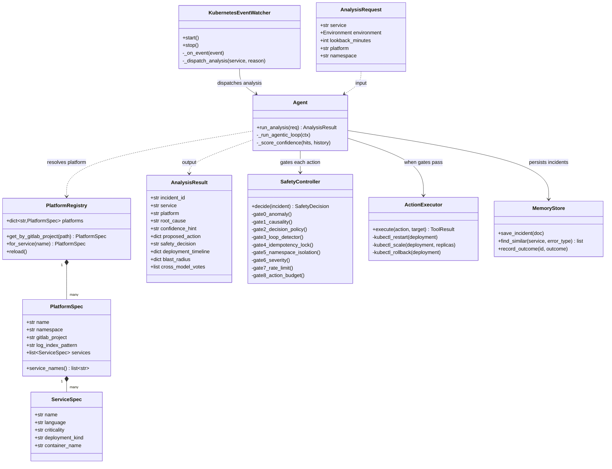
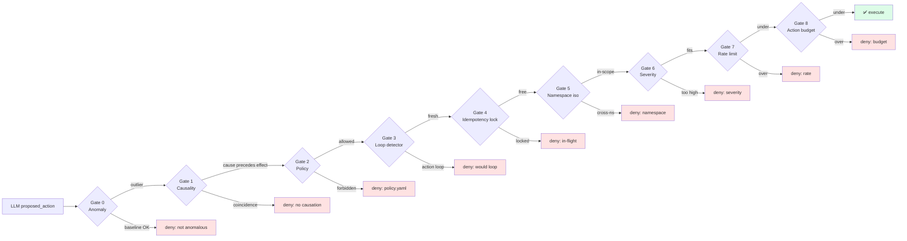
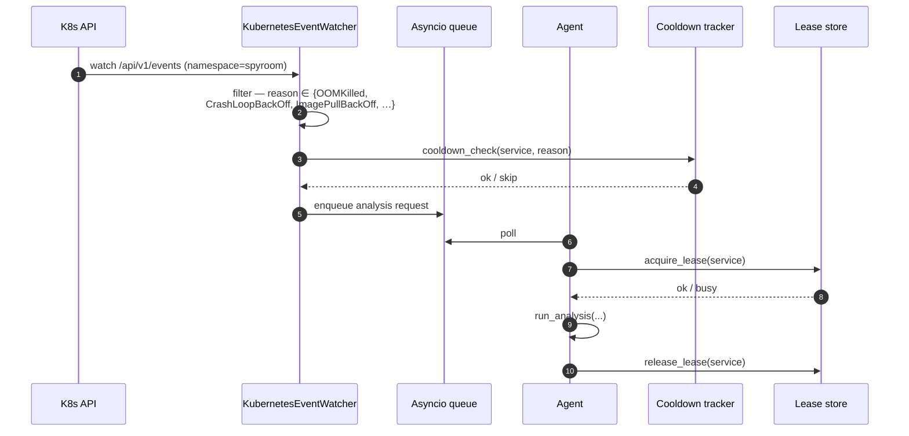

# AI DevOps Copilot

An AIOps platform that monitors application logs, reasons about failures using
a multi-provider LLM agentic loop, and proposes or executes remediation actions
through a deterministic safety pipeline.

**Multi-platform.** Originally built around a single demo service
(`sample-app`), the system now onboards any external repository through a
declarative platform config — see [`docs/PLATFORMS.md`](docs/PLATFORMS.md).
The first real onboarded platform is **SpyRoom**
(`gitlab.com/spe-group2/spyroom-platform`), a Next.js + Spring Boot
microservice fleet.  Cross-repo CI/CD integration (GitLab pipelines, signed
webhooks, MR comments) is documented in
[`docs/GITLAB_INTEGRATION.md`](docs/GITLAB_INTEGRATION.md).

## Architecture & design

This section gives readers a fast mental model before diving into the rest of
the README. It covers the system shape, the request flow on a single
incident, the key class boundaries inside `agent-backend`, the safety
pipeline, and the design decisions that drove the implementation.

### 1. System architecture

```mermaid
flowchart TB
    subgraph EXT[External platforms]
        SPYROOM[SpyRoom Platform<br/>spe-group2/spyroom-platform]
        SAMPLE[Sample app<br/>built-in demo]
        OTHER[Any onboarded repo<br/>via configs/platforms/*.yaml]
    end

    subgraph INGEST[Ingestion]
        WH["/api/v1/webhook/<br/>pipeline-failure<br/>(GitLab + GitHub Actions)"]
        WATCH[K8s event watcher<br/>(in-cluster)]
        API["/api/v1/analyze<br/>(manual trigger)"]
    end

    subgraph CORE[agent-backend (FastAPI)]
        REG[PlatformRegistry<br/>maps repo → namespace + services]
        AGENT[Agentic loop<br/>app/core/agent.py]
        TOOLS[LLM tool surface<br/>search_logs / get_error_frequency<br/>get_k8s_events / get_endpoint_stats]
        SAFETY[Safety pipeline<br/>9 gates — see §4]
        EXEC[Action executor<br/>kubectl rollout]
        VERIFY[Impact verifier<br/>ES-backed sweeper]
    end

    subgraph DATA[State / data plane]
        ES[(Elasticsearch<br/>devops-logs-*<br/>devops-incidents-*<br/>devops-leases<br/>devops-action-locks)]
        LLM[LLM providers<br/>Gemini / Claude / OpenAI<br/>«fallback chain»]
        VAULT[(HashiCorp Vault<br/>secret/llm-credentials)]
    end

    SPYROOM -->|webhook| WH
    SAMPLE -->|webhook| WH
    OTHER -->|webhook| WH
    SPYROOM -. K8s events .-> WATCH

    WH --> REG
    WATCH --> REG
    API --> REG
    REG --> AGENT

    AGENT <-->|tool use| TOOLS
    TOOLS <--> ES
    AGENT <--> LLM
    AGENT --> SAFETY
    SAFETY --> EXEC
    EXEC --> VERIFY
    VERIFY --> ES
    LLM -.->|api keys from| VAULT

    style SAFETY fill:#fee2e2
    style EXEC fill:#fef3c7
    style AGENT fill:#dbeafe
```

**Reading the diagram.** The copilot is *single-process* (one FastAPI app)
but is internally split into three planes: **ingestion** (where signals
arrive), **core** (the LLM-driven decision loop with hard safety gates), and
**data** (state in Elasticsearch, secrets in Vault, intelligence from the
LLM). Every external signal — webhook, K8s event, manual analyze call —
flows through the same agentic loop, so behaviour is identical regardless of
trigger.

### 2. Class diagram — agent-backend domain



### 3. Sequence — webhook ingestion → remediation

```mermaid
sequenceDiagram
    autonumber
    participant SRC as GitLab CI / Ansible
    participant API as FastAPI (webhooks.py)
    participant REG as PlatformRegistry
    participant AGT as Agent (core/agent.py)
    participant LLM as LLM provider
    participant ES as Elasticsearch
    participant SF as SafetyController
    participant EX as ActionExecutor
    participant K8S as kubectl
    participant VR as ImpactVerifier

    SRC->>API: POST /api/v1/webhook/pipeline-failure<br/>X-Gitlab-Token: ...
    API->>API: verify_webhook_token() — HMAC compare
    API->>REG: get_by_gitlab_project(path)
    REG-->>API: PlatformSpec(name="spyroom", ns="spyroom")
    API->>API: extract failing service from builds[].name
    API-->>SRC: 202 Accepted (incident_id)
    Note over API,AGT: webhook responds <100ms;<br/>analysis runs in background task

    API->>AGT: asyncio.create_task(run_analysis())
    AGT->>ES: search_logs(service, last 15min)
    ES-->>AGT: hits + error_frequency
    AGT->>AGT: confidence scoring + memory boost
    AGT->>LLM: agentic loop (tools: search_logs,<br/>get_error_frequency, get_k8s_events)
    LLM-->>AGT: root_cause + proposed_action + confidence
    AGT->>SF: decide(incident)
    SF->>SF: 9 gates evaluated in order
    SF-->>AGT: SafetyDecision(approved=true|false)

    alt approved
        AGT->>EX: execute(action, target)
        EX->>K8S: kubectl rollout restart deploy/auth-service
        K8S-->>EX: rolled out
        EX->>VR: enqueue verification (60-300s)
        VR->>ES: check error rate after window
        VR-->>AGT: outcome: resolved | partial | unresolved
    else denied
        AGT->>AGT: incident logged with safety_decision="denied"
    end

    AGT->>ES: PUT devops-incidents-YYYY.MM.DD/_doc/<uuid>
    AGT-->>API: AnalysisResult (via shared incident store)
```

### 4. Safety pipeline (9 deterministic gates)



**Why nine gates and not one?** Each gate is *deterministic* and *cheap*. They
catch different failure modes — a hallucinated root cause, a destructive
action proposed against the wrong namespace, an action that would create an
infinite loop with the previous incident. The LLM is treated as untrusted
input; the gates are the trusted boundary. The order matters: cheap gates
(policy lookup) come before expensive ones (causality checking on full
incident timelines).

### 5. Component sequence — K8s event-driven analysis



**Why a queue + lease store, not direct dispatch?** Without bounding
concurrency, a burst of K8s events (e.g. ten pods crashing simultaneously)
would fire ten parallel agentic loops against the same service. Leases
guarantee at-most-one in-flight analysis per service; the queue absorbs
bursts.

### 6. Architectural decisions worth calling out

| # | Decision | Reasoning |
|---|---|---|
| 1 | One FastAPI process, no celery | Webhook → background `asyncio.create_task` is sufficient for the demo; brokers add operational cost. |
| 2 | Elasticsearch as the *only* state store | Logs, incidents, leases, action locks, anomaly baselines all live there. One backup, one set of ILM policies. |
| 3 | LLM treated as untrusted | The 9-gate safety pipeline is fully deterministic. The LLM proposes; the controller disposes. |
| 4 | Multi-provider LLM with fallback chain | Rate-limit on Gemini → fall back to Claude → fall back to OpenAI. Configured in `.env`. |
| 5 | Per-platform YAML config | New repos onboarded without code changes — drop a file in `configs/platforms/`. |
| 6 | Webhook handler returns 202 in <100ms | Pipelines never block on analysis. The analysis ID returns immediately; results land in ES asynchronously. |
| 7 | Vault is optional | In docker-compose mode we fall back to env vars. In K8s, Ansible seeds Vault and pods read from there. |
| 8 | Anomaly gate uses 7-day z-score baseline | Sweeper refreshes baselines daily; gate0 rejects "incidents" that are within normal variance. |
| 9 | Idempotency via fingerprint hash | `(service, action_type, target, error_signature)` → SHA hashed → lock in ES with TTL. Prevents duplicate remediation. |
| 10 | Human approval workflow for destructive actions | HMAC-SHA256 signed token in URL; rejecting via the URL automatically denies the action. |

---

## What it does

```
Logs → ELK Stack → Log Summariser → Confidence Scorer ← Memory Boost (history)
                                          │
                                    LLM (tool use)
                                    ├── search_logs
                                    ├── get_error_frequency
                                    └── get_k8s_events
                                          │
                                  Cross-Model Voting       ← Phase 9d
                                  (destructive actions)
                                          │
                                    Causality Checker
                                          │
                                    Decision Engine (policy.yaml)
                                          │
                                  Safety Controller (9 gates)
                                  ├── 0: Anomaly gate (z-score baseline) ← Phase 9e
                                  ├── 1: Causality gate
                                  ├── 2: Decision policy
                                  ├── 3: Loop detector
                                  ├── 4: Idempotency lock
                                  ├── 5: Namespace isolation
                                  ├── 6: Severity gate
                                  ├── 7: Rate limit
                                  └── 8: Action budget
                                          │
                                    Action Executor (kubectl, async)
                                          │
                                    Impact Verifier (ES-backed sweeper)
                                          │
                                    Audit Log (devops-incidents-*)
                                          │
                                  Memory Store ← feeds confidence boost + baselines
```

---

## Quick start (docker-compose)

```bash
git clone https://gitlab.com/spe-group2/ai-devops-copilot.git
cd ai-devops-copilot

docker compose up --build -d
# Wait ~60s for Elasticsearch to become healthy

# Full end-to-end demo: failure → logs → AI → approval → remediation → verification
bash scripts/demo.sh

# Or run pieces manually:
bash scripts/simulate_failure.sh
sleep 15
curl -s -X POST http://localhost:8001/api/v1/analyze \
  -H 'Content-Type: application/json' \
  -d '{"service":"sample-app","environment":"dev","lookback_minutes":10}' \
  | jq '{root_cause, confidence_hint, proposed_action, safety_decision, incident_id}'
```

📖 **Detailed walkthrough:** [`docs/demo.md`](docs/demo.md) — narrates the full
incident lifecycle with sample outputs, dashboard screenshots, and grading
criteria mapping.

**Services after `docker compose up`:**

| Service | URL | Purpose |
|---|---|---|
| Sample app | http://localhost:8000 | Target application with failure-mode endpoints |
| Agent backend | http://localhost:8001 | AI analysis pipeline + safety controller |
| Agent dashboard | http://localhost:8001/dashboard | Server-rendered incident audit |
| Kibana | http://localhost:5601 | Application log visualizations |
| Elasticsearch | http://localhost:9200 | Log + incident store |
| Prometheus | http://localhost:9090 | Scrapes agent-backend `/metrics` |
| Grafana | http://localhost:3000 | Agent metrics dashboard (anonymous viewer) |

Kibana dashboards (Error Rate, Log Level Distribution, Endpoint Heatmap) are
automatically imported by the `kibana-setup` container on first start.
Grafana auto-loads the **AI DevOps Copilot — Agent Backend** dashboard from
`monitoring/grafana-dashboard.json`.

---

## Stack

| Layer | Tools |
|---|---|
| Version control | Git + GitLab |
| CI/CD | GitLab CI (test → evals → build → push → deploy) |
| Containerisation | Docker + Docker Compose |
| Configuration management | Ansible (roles: `vault_secrets`, `app_deploy`) |
| Orchestration | Kubernetes + HPA (1–3 replicas, CPU 70% / Memory 80%) |
| Log pipeline | Filebeat → Logstash → Elasticsearch → Kibana |
| Secret management | HashiCorp Vault (KV v2, dev mode in k8s) |
| LLM providers | Google Gemini / Anthropic Claude / OpenAI (configurable fallback chain) |

---

## CI/CD pipeline

Every push runs tests for both services. Merges to `main` build and push both
Docker images to DockerHub, then offer a manual deploy gate that runs Ansible
on a self-hosted runner.

```
git push
    │
    ├── test-sample-app   ─┐
    ├── test-agent-backend ┘  GitLab SaaS runners (remote)
    │
    ├── build-sample-app   ─┐
    ├── build-agent-backend ┘  GitLab SaaS runners
    │
    ├── push-sample-app   ─┐   GitLab SaaS runners → DockerHub
    ├── push-agent-backend ┘   (main branch only)
    │
    └── deploy  [manual]       self-hosted runner on your Mac
                    │
                    └── ansible-playbook → kubectl apply → Minikube
```

### Why the deploy job uses a self-hosted runner

GitLab SaaS runners run in remote containers that cannot reach a Minikube
cluster because Minikube binds its API server to `127.0.0.1` on your Mac and
stores TLS certificates under `~/.minikube/` — neither is reachable from a
remote machine. A shell-executor runner registered on the same Mac runs
`kubectl` natively using the existing `~/.kube/config` with no extra config.

**One-time runner setup:** see [`docs/local-runner-setup.md`](docs/local-runner-setup.md)

### Required CI variables (Settings → CI/CD → Variables)

| Variable | Description |
|---|---|
| `DOCKER_USERNAME` | DockerHub username |
| `DOCKER_PASSWORD` | DockerHub password or access token *(mark as Masked)* |
| `LLM_API_KEY` | Primary LLM API key — injected into Vault by `vault_secrets` role |
| `GOOGLE_API_KEYS` | Google Gemini API keys (comma-separated) |
| `ANTHROPIC_API_KEYS` | Anthropic Claude API keys |
| `OPENAI_API_KEYS` | OpenAI API keys (optional) |
| `VAULT_ROOT_TOKEN` | HashiCorp Vault root token *(Masked)* — defaults to `devops-copilot-root-token` |
| `SLACK_WEBHOOK_URL` | (optional) Slack incoming webhook for approval alerts |
| `APPROVAL_SECRET_KEY` | HMAC-SHA256 key for approval tokens *(Masked)* |

`KUBECONFIG_CONTENT` is **not needed** — the shell executor on your Mac uses
`~/.kube/config` directly.

---

## LLM configuration (`agent-backend/.env`)

```bash
# Primary model
LLM_MODEL=gemini-2.0-flash

# Fallback chain — tried in order when keys for the primary are exhausted
LLM_MODEL_FALLBACK=claude-haiku-4-5,gpt-4o-mini

# Per-provider key pools (comma-separated for rotation on rate-limit)
GOOGLE_API_KEYS=key1,key2
ANTHROPIC_API_KEYS=key1
OPENAI_API_KEYS=key1,key2

# Admin API key — protects /admin/* and /services/*/unfreeze endpoints
# Leave blank to disable auth in local dev mode
ADMIN_API_KEY=

# Phase 11d — Human approval workflow
APPROVAL_SECRET_KEY=change-me-in-production   # HMAC-SHA256 key for approval tokens
APPROVAL_EXPIRY_SECONDS=300                    # Token expiry (default: 5 min)
SLACK_WEBHOOK_URL=                             # Slack Block Kit notifications (optional)

# Phase 10 — HashiCorp Vault (auto-configured in k8s; not needed in docker-compose)
VAULT_ADDR=http://vault:8200
VAULT_TOKEN=devops-copilot-root-token
```

---

## HashiCorp Vault (Phase 10)

In Kubernetes, LLM API keys are stored in Vault instead of plain environment
variables.  The Ansible `vault_secrets` role provisions Vault on first deploy:

1. Deploys `k8s/vault.yaml` (Vault pod in dev mode — for dev/demo clusters)
2. Enables KV v2 secrets engine at `secret/`
3. Writes `LLM_API_KEY`, `GOOGLE_API_KEYS`, `ANTHROPIC_API_KEYS`, `OPENAI_API_KEYS`,
   `LLM_MODEL` to `secret/data/llm-credentials`

The `agent-backend` reads secrets at startup from Vault via `app/utils/vault_client.py`.
If Vault is unreachable (docker-compose mode), it falls back to environment variables.

```bash
# Verify secrets after deploy
kubectl exec -it vault-0 -n devops-copilot -- vault kv get secret/llm-credentials
```

---

## Blast-radius estimation (Phase 10)

Every analysis computes how many services would be affected if the proposed
action is executed:

```json
"blast_radius": {
  "score": "high",
  "affected_count": 4,
  "affected_services": ["api-gateway", "auth-service", "payment-api", "sample-app"],
  "direct_dependents": ["api-gateway"],
  "source": "k8s_annotations"
}
```

Blast radius is computed by BFS on the **reverse** dependency graph built from
`devops-copilot/depends-on` annotations on Deployments (cached 60s; falls back
to the static map in `causality.py`).

Scores: `0 affected → low` · `1–2 → medium` · `3–5 → high` · `>5 → critical`

The safety gate (gate 6b) tightens requirements based on blast radius:

| Blast radius | Required confidence | Required severity |
|---|---|---|
| `critical` | `high` | `critical` |
| `high` | `high` | `high` |
| `medium` | `medium` | `high` |
| `low` | (no change) | (no change) |

---

## Deployment-aware incident intelligence

When a service fails shortly after a rollout, the most likely cause is the
rollout itself.  `app/core/deployment_correlation.py` adds this signal to
every analyze response.

**What it does (in three steps):**

1. **Query k8s** — `apps/v1` Deployment list for the target namespace,
   matched by name OR `app` / `app.kubernetes.io/name` /
   `devops-copilot/service` label.  The rollout timestamp comes from the
   newest `Progressing` / `Available` condition.  Image tag from
   `spec.template.spec.containers[0].image`.  Cached 30s per
   `(namespace, service)`.

2. **Correlate with the change-point** — the log summarizer already
   detects when the error rate spiked (`change_point_minutes_ago`).  If
   a rollout happened in the window AND it precedes the change-point
   AND the gap is ≤ window → `deployment_suspected = true`.  This is a
   deliberately conservative heuristic; false positives erode trust.

3. **Recommend (don't act)** — when `deployment_suspected` AND
   `confidence_score >= 7` AND the namespace is **not** in
   `PRODUCTION_NAMESPACES` (env, default `production,prod`), generate a
   `rollback_candidate` with `auto_executable: false`.  Operators
   confirm via the existing approval workflow.  Never auto-runs.

**Surfaced inline on `/api/v1/analyze`:**

```json
{
  "deployment_timeline": [
    {
      "deployment_name": "auth-service",
      "image_tag": "spyroom/auth-service:abc123",
      "rolled_out_at": "2026-05-15T10:30:00+00:00",
      "deployment_age_minutes": 5.2,
      "minutes_before_incident": 2.1
    }
  ],
  "deployment_suspected": true,
  "rollback_candidate": {
    "deployment": "auth-service",
    "current_image": "spyroom/auth-service:abc123",
    "recommended_action": "rollback",
    "reason": "Error spike detected 2.1m after rollout of spyroom/auth-service:abc123",
    "blast_radius_score": "medium",
    "auto_executable": false
  }
}
```

**Hard safety gates** (rollback candidate suppressed when any fails):

| Gate | Default | Override |
|---|---|---|
| Namespace must NOT be production | `production`, `prod` | env `PRODUCTION_NAMESPACES` |
| `confidence_score >= threshold` | 7 (≈ "high") | env `ROLLBACK_CANDIDATE_MIN_SCORE` |
| Change-point must exist in summary | required | (not configurable — degraded signal must not auto-recommend) |
| `is_production` flag override | derived | function arg `is_production=` |

**Structured logs** (greppable in `kubectl logs`):
- `deployment_analysis_started` — entry point
- `deployment_correlation_detected` — heuristic fired for a specific rollout
- `rollback_candidate_generated` — recommendation surfaced
- `rollback_candidate_suppressed` — why no recommendation despite suspicion
- `k8s_deployment_fetch_failed` — k8s API unreachable; degrades to `source="unavailable"`

**Demo path:**

```bash
tools/simulate-deployment-failure.sh --service room-service
# triggers a rollout, generates error traffic, runs analyze, prints
# deployment_timeline + rollback_candidate
```

**Unit tests:** `tests/test_deployment_correlation.py` — 14 cases covering
the heuristic, the production safety gate, the confidence threshold,
graceful degradation when the k8s API is unreachable, and the response
schema contract.

---

## K8s event-driven incident triggering

The on-demand `/api/v1/analyze` endpoint and the GitLab pipeline-failure
webhook handle *reactive* triggers.  For incidents that only show up as
Kubernetes events (`OOMKilled`, `CrashLoopBackOff`, `ImagePullBackOff`,
`NodeNotReady`, …), the agent-backend now runs an in-process **K8s event
watcher** that observes the `spyroom` namespace's event stream and
dispatches the existing analyze pipeline automatically.

**Architecture.** Watcher → `AnalysisRequest` → `run_analysis()`. No new
analyzer, no event bus, no operator/CRD.  All gates from the existing
safety stack apply unchanged.  Lives in
`agent-backend/app/watchers/k8s_event_watcher.py` (~700 LOC including
the bounded queue, dispatch coroutine, reconnect-backoff, and heartbeat).

### What triggers (reason-based, never type-based)

```
CRITICAL_REASONS = {OOMKilled, CrashLoopBackOff, ImagePullBackOff,
                    ErrImagePull, FailedScheduling,
                    NodeNotReady, Evicted,
                    MemoryPressure, DiskPressure, PIDPressure,
                    NetworkUnavailable}
WARNING_REASONS  = {Unhealthy, BackOff, Failed, FailedMount, Killing}
IGNORE_REASONS   = {Pulled, Created, Started, Scheduled,
                    SuccessfulCreate, SuccessfulRescale, …}
```

Some runtimes emit `OOMKilled` as `event.type=Normal` (containerd /
cgroupv2).  Filtering by reason — not by type — is the only reliable
gate across runtimes.

### Safeguards baked in

| Concern | Mechanism |
|---|---|
| Event storms | Bounded async queue (max 100, drop-oldest), global sliding 60s rate limit (default 20/min) |
| Duplicate floods | Per-`(service, reason)` cooldown (default 300s) |
| Analyzer overload | `asyncio.Semaphore(3)` caps in-flight watcher-triggered analyses |
| K8s API hiccups | Exponential reconnect backoff (1s → 30s cap), explicit request timeouts |
| Stuck connection | Server-side stream timeout 60s + heartbeat detector (5min) |
| Pod shutdown | `threading.Event` paired to the lifespan's `asyncio.Event`; bounded join with 6s deadline |

### Observability

Eight new Prometheus metrics on the existing `/metrics` endpoint:
`agent_k8s_events_received_total{namespace,reason,severity}`,
`agent_k8s_events_skipped_total{namespace,reason}` (reasons:
`cooldown` / `ignore_set` / `unknown_reason` / `unresolvable_service` /
`rate_limit` / `queue_full`), `agent_k8s_analyses_triggered_total`,
`agent_k8s_cooldown_hits_total`, `agent_k8s_watcher_reconnects_total`,
`agent_k8s_events_dropped_total`, `agent_k8s_queue_depth`,
`agent_k8s_concurrent_analyses`.

Structured log keys (greppable in `kubectl logs`):
`k8s_event_watcher_started`, `k8s_event_detected`, `k8s_event_skipped`
(with `skip_reason`), `k8s_event_analysis_triggered`,
`k8s_event_analysis_completed`, `watcher_reconnect`, `watcher_stuck`.

### Feature flag

The watcher is **disabled by default** so this Phase 1 ships safely.
Flip it on per environment:

```bash
# Enable
kubectl patch secret llm-credentials -n default --type=merge \
  -p '{"stringData":{"K8S_WATCHER_ENABLED":"true"}}'
kubectl rollout restart deployment/agent-backend -n default

# Rollback — 1-minute env change + pod restart
kubectl patch secret llm-credentials -n default --type=merge \
  -p '{"stringData":{"K8S_WATCHER_ENABLED":"false"}}'
kubectl rollout restart deployment/agent-backend -n default
```

All knobs (`K8S_WATCHER_NAMESPACE`, `K8S_WATCHER_COOLDOWN_SECONDS`,
`K8S_WATCHER_QUEUE_MAXSIZE`, `K8S_WATCHER_MAX_CONCURRENT`,
`K8S_WATCHER_RATE_LIMIT_PER_MIN`, `K8S_WATCHER_RECONNECT_BACKOFF_MAX`,
`K8S_WATCHER_LOOKBACK_MIN`) are env-overridable; see the module
docstring for defaults.

### Demo path

```bash
tools/simulate-k8s-event-failure.sh
# Applies a Deployment with image=spyroom/does-not-exist:0 in ns=spyroom.
# Within ~10s kubelet emits ImagePullBackOff events.
# The watcher detects them, dispatches run_analysis, and logs:
#   k8s_event_detected            { reason: ImagePullBackOff, severity: critical, … }
#   k8s_event_analysis_triggered  { service: auth-service-broken, … }
#   k8s_event_analysis_completed  { incident_id: …, proposed_action: notify }
# Cleanup runs automatically (or pass --keep to leave the Deployment behind).
```

### Tests

`agent-backend/tests/test_k8s_event_watcher.py` — 34 unit tests covering
reason-only filtering (incl. `type=Normal` accepted on `OOMKilled`),
severity tiers, cooldown, sliding rate limit, bounded queue overflow,
service-name normalisation (Pod/Deployment/StatefulSet/ReplicaSet/Node),
dispatch happy path, dispatch shutdown latency (<1s), watch-loop
reconnect on exception, and graceful degradation when `kubernetes` is
unavailable.  All async tests use `asyncio.wait_for` with bounded
timeouts so a regression to a blocking await fails fast rather than
hangs.

### What's next (deferred phases — see `/Users/rohit2026/.claude/plans/happy-petting-lantern.md`)

Phase 2 (`K8S_EVENTS_AS_EVIDENCE`): pass the triggering event into the
analyzer as first-class evidence so the LLM sees `OOMKilled` /
`restart_count` verbatim.
Phase 3 (`DEPLOYMENT_REVISION_TRACKING`): correlate failing pod → owning
ReplicaSet revision; per-revision rollback candidate.
Phase 4 (`FAILURE_DOMAIN_CLASSIFIER`): 6-way deterministic classifier,
refuse rollback in `infrastructure` domain.
Phase 5 (`EVIDENCE_DEDUP_CAP`): drop internal copilot telemetry + Spring
startup chatter from evidence; dedupe + token cap.

---

## Human approval workflow (Phase 11)

High-impact actions are gated behind human approval before execution.

### When approval is required

Any of:
- Service has `devops-copilot/criticality: critical` annotation
- Action type is `rollback`
- Blast-radius score is `high` or `critical`
- Destructive action with confidence < `high`

### Approval flow

```
analyze() called
    │
    ├── safety gates pass → requires_approval() check
    │       │
    │       ├── approval required → create ApprovalRequest → send Slack notification
    │       │       │
    │       │       └── action_state: "awaiting_approval"
    │       │
    │       └── no approval required → execute immediately
    │
    └── Operator clicks Approve (or Reject) in Slack / calls API
            │
            └── POST /api/v1/approvals/{id}/approve?token=<hmac>
                    │
                    └── token verified → action_state: "approved" → execute
```

Approval tokens are HMAC-SHA256 signed (`APPROVAL_SECRET_KEY`).  Forged or
expired tokens return 403.  The token is embedded in the Slack button URLs.

### Slack notification

When `SLACK_WEBHOOK_URL` is set, approval-required incidents send a Block Kit
message:

```
⚠️  Approval Required — restart_pod sample-app
Service: sample-app    Action: restart_pod
Blast Radius: high     Confidence: 8/10
Reason: destructive action on blast-radius=high service
Confidence breakdown:
  • +2 error_type=runtime_crash (known type)
  • +2 severity=high
  ...
[✅ Approve]   [❌ Reject]
```

Unset `SLACK_WEBHOOK_URL` → feature is a no-op and actions execute directly
(`dev`-mode behaviour unchanged).

---

## Pipeline failure webhook (Phase 11)

Register `POST /api/v1/webhook/pipeline-failure` as a webhook in GitLab
(Settings → Webhooks → Pipeline events) or GitHub Actions (repository dispatch):

```bash
# GitLab CI — set in Settings → Webhooks
URL: http://<agent-backend-host>:8001/api/v1/webhook/pipeline-failure
Trigger: Pipeline events

# Test manually
curl -s -X POST http://localhost:8001/api/v1/webhook/pipeline-failure \
  -H 'Content-Type: application/json' \
  -d '{
    "object_kind": "pipeline",
    "object_attributes": {"status": "failed"},
    "project": {"name": "sample-app"},
    "commit": {"id": "abc12345"},
    "builds": []
  }' | jq
```

On receipt, the webhook extracts the failing service name from the payload
and fires an analysis in the background (non-blocking — the webhook responds
in <1s).  Results appear in the audit dashboard and `GET /api/v1/metrics`.

---

## API reference

| Method | Path | Auth | Description |
|---|---|---|---|
| `POST` | `/api/v1/analyze` | — | Run full analysis pipeline |
| `GET` | `/api/v1/incidents/{id}` | — | Poll async action state |
| `GET` | `/api/v1/incidents/{id}/timeline` | — | Chronological event timeline for an incident |
| `GET` | `/api/v1/metrics` | — | JSON operational metrics (fix rate, MTTR, …) |
| `GET` | `/metrics` | — | Prometheus scrape endpoint |
| `GET` | `/dashboard` | — | HTML incident dashboard (last 50 incidents) |
| `POST` | `/api/v1/services/{service}/unfreeze` | Admin key | Clear a frozen service |
| `POST` | `/api/v1/admin/reload-policy` | Admin key | Hot-reload `policy.yaml` |
| `POST` | `/api/v1/webhook/pipeline-failure` | — | GitLab CI / GitHub Actions failure webhook |
| `GET` | `/api/v1/approvals/{id}` | — | Get pending approval request status |
| `POST` | `/api/v1/approvals/{id}/approve` | Signed token | Approve a high-impact action |
| `POST` | `/api/v1/approvals/{id}/reject` | Signed token | Reject a high-impact action |
| `GET` | `/health` | — | Liveness check |

Admin endpoints require the `X-Admin-Key: <value>` header when `ADMIN_API_KEY`
is set in `.env`.

### Analyze — example response

```json
{
  "root_cause": "Connection refused to downstream elasticsearch:9200",
  "confidence_hint": "high",
  "confidence_score": 8,
  "confidence_breakdown": [
    "+2 error_type=dependency_error",
    "+2 severity=high",
    "+2 error_ratio=0.80 (>10%)",
    "+1 event_count=12 (>=10)",
    "+1 historical_match (2 of 3 similar incidents resolved)"
  ],
  "proposed_action": {"type": "notify", "target": "sample-app", "reason": "..."},
  "safety_decision": "allowed",
  "causality_verified": true,
  "incident_id": "550e8400-e29b-41d4-a716-446655440000",
  "execution_result": {"status": "executing"},
  "anomaly_score": 3.14,
  "cross_validation": {"agreed": true, "primary_model": "gemma-4-31b-it", "secondary_model": "claude-haiku-3-5"},
  "cascade_depth": 1,
  "upstream_incident_id": "db-incident-uuid",
  "incident_chain_id": "chain-uuid"
}
```

`/analyze` returns immediately. Poll `GET /api/v1/incidents/{id}` for the
final `action_state` when an action is executing asynchronously.

---

## Sample-app failure endpoints

| Endpoint | Behaviour | Env var |
|---|---|---|
| `GET /error` | Always returns `status: error` | — |
| `GET /slow` | Sleeps `SLOW_MS` ms; 504 if > `SLOW_THRESHOLD_MS` | `SLOW_MS`, `SLOW_THRESHOLD_MS` |
| `GET /crash` | Raises `RuntimeError(CRASH_MESSAGE)`; always 500 | `CRASH_MESSAGE` |
| `GET /dep-error` | Calls `DOWNSTREAM_URL`; 503 on failure | `DOWNSTREAM_URL` |
| `GET /oom` | Allocates `MEM_MB` MB in memory | `MEM_MB` |

---

## Safety pipeline (9 gates)

Every proposed action passes all gates sequentially before touching the cluster:

| # | Gate | Blocks when |
|---|---|---|
| 0 | **Anomaly gate** | z-score < 2.0 vs 7-day baseline — error rate is statistically routine |
| 1 | Causality | Root cause not evidenced in logs |
| 2 | Decision policy | Action type not allowed for `(error_type, severity, confidence)` |
| 3 | Loop detector | ≥5 consecutive unresolved actions → service frozen |
| 4 | Idempotency lock | Identical action already in flight (atomic ES `op_type=create`) |
| 5 | Namespace isolation | Target is `kube-system` or `monitoring` |
| 6 | Severity gate | Destructive action on low severity or low confidence |
| 7 | Rate limit | >3 restarts for this service in 10 minutes |
| 8 | Action budget | >5 automated actions across all services in 1 hour |

Gate 0 only fires once the service has ≥5 baseline samples (7-day rolling window
updated nightly). A new service bypasses the anomaly gate until enough history
accumulates. The `anomaly_score` z-score is included in every `AnalysisResult`.

Failures are downgraded to `notify` and recorded in the incident audit log.

All thresholds are editable in `policy.yaml` — reload live with `SIGHUP` or
`POST /api/v1/admin/reload-policy`.

---

## Kubernetes deployment

The full production stack (sample-app + agent-backend + ELK + Prometheus + Grafana
+ Vault + RBAC + HPAs) is layered into four directories:

```
k8s/
├── *.yaml             ← application layer (sample-app, agent-backend, vault, RBAC, HPAs)
├── elk/               ← Elasticsearch StatefulSet, Logstash, Kibana, Filebeat DaemonSet
├── monitoring/        ← Prometheus + Grafana
└── test/              ← ephemeral kind cluster manifests for e2e tests
```

### One-command deploy via Ansible (recommended)

```bash
cd ansible
ansible-playbook -i inventory.ini deploy.yml
```

The playbook runs four roles in order: `vault_secrets` → `elk_stack` →
`monitoring` → `app_deploy`. Each role is independently re-runnable and
selectable via tags:

```bash
ansible-playbook -i inventory.ini deploy.yml --tags elk        # only ELK
ansible-playbook -i inventory.ini deploy.yml --skip-tags monitoring
```

### Manual kubectl apply (production)

```bash
kubectl apply -f k8s/vault.yaml             # secret store
kubectl apply -f k8s/elk/                   # ES + Logstash + Kibana + Filebeat
kubectl apply -f k8s/monitoring/            # Prometheus + Grafana
kubectl apply -f k8s/rbac.yaml              # agent-backend ServiceAccount + ClusterRole
kubectl apply -f k8s/networkpolicy.yaml     # in-cluster-only access
kubectl apply -f k8s/deployment.yaml        # sample-app (RollingUpdate, 2 replicas)
kubectl apply -f k8s/service.yaml           # sample-app NodePort (30007)
kubectl apply -f k8s/agent-backend.yaml     # agent-backend Deployment + ClusterIP
kubectl apply -f k8s/hpa.yaml               # sample-app HPA (1–5)
kubectl apply -f k8s/hpa-agent-backend.yaml # agent-backend HPA (1–3)

kubectl get pods,hpa -o wide
```

### Image tag overrides (CI deployments)

```bash
ansible-playbook -i inventory.ini deploy.yml \
  -e "sample_app_image=logicule/sample-app:abc1234" \
  -e "agent_image=logicule/agent-backend:abc1234"
```

### Local kind cluster (testing)

```bash
bash scripts/e2e_setup.sh
kubectl port-forward svc/agent-backend 8001:8001 -n devops-test &
kubectl port-forward svc/sample-app    8000:8000 -n devops-test &
bash scripts/e2e_teardown.sh   # cleanup
```

---

## Testing

```bash
# Unit + integration tests (no cluster, no real LLM)
cd agent-backend
pytest tests/ --ignore=tests/e2e --ignore=tests/test_integration_llm.py -q
# 544 tests pass

# Sample-app tests
cd sample-app && pytest test_app.py -q
# 12 tests pass

# Real LLM integration (API key required)
GOOGLE_API_KEYS="AIza..." pytest agent-backend/tests/test_integration_llm.py -v -s

# End-to-end against kind cluster
bash scripts/e2e_setup.sh
pytest agent-backend/tests/e2e/ -v -s

# Offline eval suite (20 hand-authored scenarios)
bash scripts/run_evals.sh
# Expected: ≥70% root-cause accuracy, ≥80% action correctness, ≤20% false-positive rate

# Generate 80 parameterized variants and run all 100
bash scripts/run_evals.sh --generated
```

---

## Observability

| Endpoint | What it returns |
|---|---|
| `GET /dashboard` | HTML table of the last 50 incidents with service/outcome filters |
| `GET /api/v1/incidents/{id}/timeline` | Chronological events: error spike → analysis → tool calls → safety → action → impact |
| `GET /api/v1/metrics` | JSON: fix rate, false-positive rate, MTTR p50/p95, safety denials, frozen services |
| `GET /metrics` | Prometheus text format — scrape with any standard collector |

Prometheus metrics exported:
- `agent_analysis_total{service,outcome}` — incidents processed
- `agent_analysis_duration_seconds` — end-to-end latency histogram
- `agent_llm_call_total{provider,model,result}` — LLM call outcomes
- `agent_llm_call_duration_seconds{provider}` — LLM latency
- `agent_safety_denials_total{reason}` — which gate is blocking most often
- `agent_actions_executed_total{action_type,status}` — remediation outcomes

---

## Trust & empirical validation

The system's decision path has two independent layers to prevent hallucinated actions:

**Cross-model voting (Phase 9d):** For destructive actions (`restart_pod`, `rollback`,
`scale_up`) on `high`/`critical` severity incidents, a second LLM is consulted.
If the two models propose different actions, the result is downgraded to `notify`
and the disagreement is recorded in `cross_validation` in the response.

**Statistical anomaly baseline (Phase 9e):** Each service maintains a rolling 7-day
baseline of error ratio in Elasticsearch (`devops-baselines` index). The anomaly
gate (gate #0) computes a z-score on each analysis. If z < 2.0 the error rate is
not statistically anomalous — destructive actions are blocked regardless of what
the LLM proposes. Baselines are refreshed nightly by a background sweeper. A
service with fewer than 5 baseline samples bypasses the gate.

**Offline eval suite:** 20 hand-authored scenarios covering all major failure
archetypes (OOM, CrashLoop, dependency errors, build failures, and healthy traffic
that should not trigger actions). Run with `bash scripts/run_evals.sh`.

---

## Persistence

- **Elasticsearch data** survives `docker compose down/up` via the `esdata` named volume.
- In K8s, ES uses a StatefulSet with a 5 GiB PVC (`k8s/elk/elasticsearch.yaml`).
- **Incidents** written to daily indices `devops-incidents-YYYY.MM.DD` with 90-day ILM delete policy.
- **Pending verifications** queued in ES — the background sweeper recovers them after pod restarts.
- **Action locks and leases** in ES — safe under multi-replica (HPA) deployments.

---

## CSE 816 evaluation criteria mapping

| Criterion | Marks | Where it lives |
|---|---|---|
| **Working Project (20)** | 20 | All flows wired end-to-end ([demo.md](docs/demo.md)) |
| Git push triggers fetch → build → test | – | `.gitlab-ci.yml` test + evals + build stages |
| Push to DockerHub | – | `.gitlab-ci.yml` push-{sample-app,agent-backend} on main |
| Deploy via Ansible | – | `.gitlab-ci.yml` deploy stage; `ansible/deploy.yml` |
| Refresh shows changes seamlessly | – | `k8s/deployment.yaml` (2 replicas + maxUnavailable=0) |
| Logs feed into ELK | – | `k8s/elk/filebeat.yaml` DaemonSet → Logstash → ES |
| Kibana dashboards | – | `elk/kibana-dashboard.ndjson` auto-imported |
| **Advanced Features (3)** | 3 | |
| Vault for secure credentials | – | `k8s/vault.yaml`, `app/utils/vault_client.py`, `ansible/roles/vault_secrets` |
| Roles in Ansible (modular) | – | 4 roles: `vault_secrets`, `elk_stack`, `monitoring`, `app_deploy` |
| Kubernetes HPA | – | `k8s/hpa.yaml` (sample-app), `k8s/hpa-agent-backend.yaml` (agent) |
| **Innovation (2)** | 2 | |
| AIOps domain | – | LLM agentic loop + 9-gate safety stack + cross-model voting + statistical anomaly baseline + blast-radius graph + HMAC-signed approval workflow + offline eval suite |
| Multi-platform onboarding | – | `configs/platforms/*.yaml` + `PlatformRegistry`; SpyRoom is the first real onboarded app — see [`docs/PLATFORMS.md`](docs/PLATFORMS.md) |
| Cross-repo CI/CD via signed webhook | – | `ci-templates/.gitlab-ci.spyroom.example.yml` shows the template a monitored repo drops in; HMAC-verified at `POST /api/v1/webhook/pipeline-failure`. See [`docs/GITLAB_INTEGRATION.md`](docs/GITLAB_INTEGRATION.md) |

---

## Project structure

```
.
├── agent-backend/
│   ├── app/
│   │   ├── api/            routes, auth (API-key guard)
│   │   ├── core/           agent, safety (9 gates), decision, causality,
│   │   │                   confidence, loop_detector, rollback, anomaly,
│   │   │                   blast_radius, approval, action_executor,
│   │   │                   impact, policy, audit, metrics_builder
│   │   ├── llm/            client (multi-provider + cross-model voting),
│   │   │                   tools (3 tools), prompt, sanitize (injection defence)
│   │   ├── log_processor/  summarizer, parser, classifier, extractor
│   │   ├── api/v1/         dashboard (HTML), routes, webhooks, auth
│   │   ├── integrations/   slack (Block Kit approval notifications)
│   │   └── services/       elk_service, memory_store (leases, ILM)
│   ├── tests/              544 tests; e2e/ auto-skips without cluster
│   └── policy.yaml         live-editable safety policy
├── sample-app/             FastAPI app with injectable failure endpoints
├── evals/
│   ├── incidents/          20 hand-authored eval fixture archetypes
│   ├── generated/          80 parameterised variants (git-ignored)
│   ├── results/            timestamped JSON eval reports
│   └── run_evals.py        offline eval harness
├── elk/
│   ├── logstash.conf       JSON parse + ES output
│   ├── filebeat.yml        reads /app/logs/app.log
│   └── kibana-dashboard.ndjson   auto-imported dashboard
├── k8s/
│   ├── deployment.yaml         sample-app Deployment (2 replicas, RollingUpdate)
│   ├── agent-backend.yaml      agent-backend Deployment + Service + criticality annotation
│   ├── service.yaml            sample-app NodePort
│   ├── hpa.yaml                HPA 1–5 replicas CPU/memory (sample-app)
│   ├── hpa-agent-backend.yaml  HPA 1–3 replicas CPU 70% / Memory 80%
│   ├── vault.yaml              HashiCorp Vault (dev mode) Deployment + Service
│   ├── rbac.yaml               ServiceAccount + ClusterRole for agent-backend
│   ├── networkpolicy.yaml      In-cluster-only access for agent-backend
│   ├── namespace.yaml          devops-copilot Namespace
│   ├── elk/
│   │   ├── elasticsearch.yaml  StatefulSet + PVC + ILM bootstrap Job
│   │   ├── logstash.yaml       Deployment + ConfigMap (Beats input → ES output)
│   │   ├── kibana.yaml         Deployment + dashboard auto-import Job
│   │   └── filebeat.yaml       DaemonSet + RBAC (ships container logs)
│   ├── monitoring/
│   │   ├── prometheus.yaml     Deployment + RBAC (scrapes agent-backend /metrics)
│   │   └── grafana.yaml        Deployment + datasource + dashboard provisioning
│   └── test/                   ephemeral kind cluster manifests
├── monitoring/
│   └── grafana-dashboard.json  6-panel agent metrics dashboard
├── ansible/
│   ├── deploy.yml              vault_secrets → elk_stack → monitoring → app_deploy
│   └── roles/
│       ├── vault_secrets/      Vault provisioning + secret injection
│       ├── elk_stack/          ELK deployment + dashboard ConfigMap
│       ├── monitoring/         Prometheus + Grafana + dashboard provisioning
│       └── app_deploy/         tasks, handlers, defaults
├── docs/
│   ├── demo.md                 End-to-end walkthrough with grading mapping
│   ├── local-runner-setup.md   Self-hosted GitLab runner setup
│   └── screenshots/            Kibana / Grafana / dashboard screenshots
├── scripts/
│   ├── demo.sh                 Interactive end-to-end walkthrough
│   ├── simulate_failure.sh     Inject errors into sample-app
│   ├── e2e_setup.sh            Bootstrap kind cluster
│   ├── e2e_teardown.sh         Tear down kind cluster
│   ├── gen_eval_fixtures.py    Parameterised variant generator
│   └── run_evals.sh            Eval suite runner
└── docker-compose.yml
```
